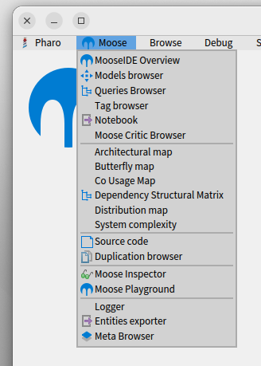

<!-- headingDivider: 1 -->
<!-- paginate: true -->
<!-- footer: "MooseIDE -- Plateforme interactive d'analyse logicielle" -->

# MooseIDE

- Interface utilisateur de Moose
- Objectifs
  - Evolutive (ajout de nouveaux outils)
  - Polyglote (Méta-modèle composable Famix)
  - Tous niveaux ("novices" / experts)

# Architecture

- Basée sur Moose (Famix, Roassal, MooseQuery, Tagging) et Pharo (Spec)
- Ensemble de micro-outils collaborant entre eux
- Échangent des informations sur des bus de données
- Bus véhiculent des entités Famix

# Micro-Outils

- Attachés a 0, 1, *n* bus
- Lisent et écrivent des entités sur leur(s) bus
- Ont chacun 1 tâche précise
  - *Model Browser* : création/import de modèles Famix
  - *Moose Query* : sélection d'entités dans une collection
  - *Entities exporter* : export CSV d'entités
  - ...

# Architecture

