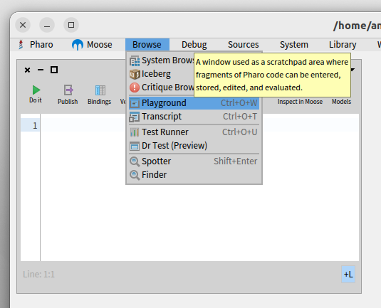
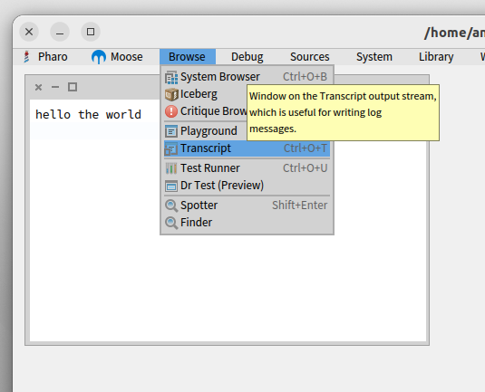
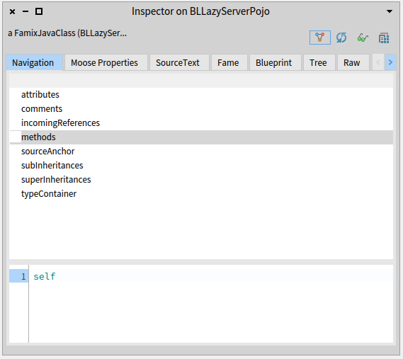

<!-- headingDivider: 1 -->
<!-- paginate: true -->
<!-- footer: "Pharo -- Environment d'exécution" -->

# Pharo -- Environnement d'exécution

- Playground
- Transcript
- Inspector

# Playground



- "Live environment"
- Une "console" pour manipuler des objets
- ex : "Print it" (ctrl-P) sur
  ```
  #( 6 45 36 8 3 ) median
  ```

# Transcript



- Affichage de traces
```
'hello' trace.
Character space trace.
'the world' tarceCr.
```

# Inspector



- Inspecter le contenu d'un objet (variables d'instances)
- Onglets dépendent de la classe de l'objet
- Onglets "universels" : `Raw`, `Meta`

# Environnement d'exécution

- Exercice : Que fait ?
```
| rnd |
rnd := Random new.
5 timesRepeat: [ (rnd nextIntegerBetween: 1 and: 50) asString traceCr ]
```

# Exercices

À faire dans un *Playground* :

- Additionner 2 nombres et afficher "pair" ou "impair" selon le résultat
ex : `2 + 3 ...` affiche `impair`
- Faire un bloc avec 2 paramètres qui retourne une chaîne de caractères
"<x> + <y> est <pair/impair>"

# Exercices sur les collections

- Trouver la superclasse des DTOs : `BLLazyServerPojo`
- Trouver tous les DTOs (sous-classes de `BLLazyServerPojo`)
- Éliminer les sous-classes abstraites de `BLLazyServerPojo`
- Trouver les sous-classes de `BLLazyServerPojo` dont le nom commence par 'Abstract'

# Exercices sur les collections (suite)

- Trouver toutes les sous-classes de `UserTypeEnumAbstract`
- Trouver les sous-classes de `UserTypeEnumAbstract` dont le nom ne commence pas par 'Enum'
- Trouver les sous-classes de `BLLazyServerPojo` dont le nom ne contient pas 'Abstract', 'DTO', ou 'Enum'
- Trouver les classes dont le nom contient 'DTO' qui n'heritent pas de `BLLazyServerPojo` (ex: `ProductDTO`)

# *Cheat Sheet* -- Pharo

- Méthodes sur les collections : `#select:`, `#collect:`, `#reject:`, `#detect:`, `#detect:ifNone:`
- Tester le début d'une string : `<string> beginsWith: <subString>`
- Tester la fin d'une string : `<string> endsWith: <subString>`
- Tester la présence d'une sous-chaîne : `<string> includesSubstring: <subString>`
- Passer une string en minuscules: `#asLowercase`

# *Cheat Sheet* -- Moose/Famix

- Toutes les classes d'un modèle :
  - `<model> allClasses`
  - `<model> allWithType: FamixJavaClass`
- Les sous-classes d'une classe :
  - `#directSubclasses`
  - `#subclassHierarchy`
- Tester si une classe est déclarée abstraite: `#isAbstract`
