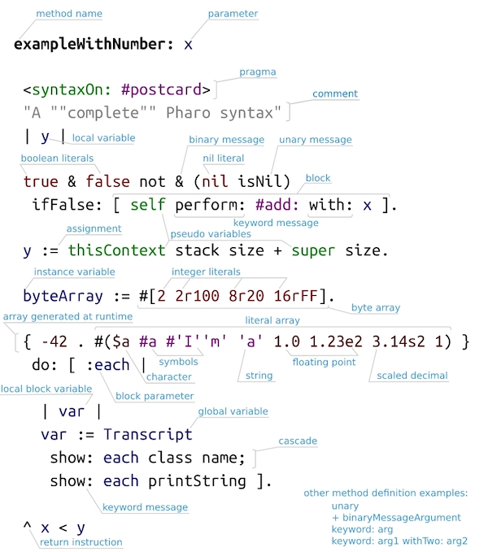

<!-- headingDivider: 1 -->
<!-- paginate: true -->
<!-- footer: "Pharo -- Le langage" -->

# Pharo -- Le langage



- Simple et élégant
- Complètement Objet

# Mots réservés

- `nil`
- `true`, `false`
- `self`
- `super`
- (`thisContext`)

# Instructions

- Pas d'instruction de boucle
- Pas d'instruction de test
- Pas d'opérateurs
  - Pas d'expressions arithmétiques ou booléennes
- Tout est fait par **message**

# Instructions

- Affectation : `variable := 5`
- Retour de  méthode : `^ 42`
- Envoi de message : `object aMethod.`
- Le point (`.`) comme *séparateur* d'instruction

# Variables

- Non typées statiquement
- Doivent être déclarées
- Parmètres de méthodes : `#between: min and: max`
- Variables locales (temporaires) : `| x y autreVariable |`
- Par convention, nomage CamelCase, jamais de underscore (`_`)

# Litéraux et commentaires

- Nombre : `42`, `3.14`, `2e25`
- Chaîne de caractères : `'This is a String with ''quotes'' !'`
- Symbole (chaîne de caractères unique) : `#aSymbol`, `#'More complex!'`
- Caractères : `$a`, `$:`, `$'`, ...
- Commentaires : `"Il est important de commenter les classes et les méthodes"`


# Tableaux

- Tableau de litéraux ("literal array") : `#( 1 $a Symbol )`
- Tableaux "dynamique" : `{ 1 . 42 . 3+5 }`
Valeurs séparées par des points `.` et évaluées
- `#( 3+5 ) = { 3 . $+ . 5 }`
- `{ 3+5 } = #( 8 )`

# Les blocs

- Functions anonymes, "lambda" (en fait Closure)
- Sans paramètres : `[ 'Hello' traceCr ]`
- Avec paramètres : `[ :param | 'Hello ' trace. param traceCr ]`
- Avec variales locales : `[ :param ||a x| 'Hello ' trace. param traceCr ]`

# Les blocs

- Peuvent être passés en paramètre (très courant)
- Peuvent être stocké dans des variables (plus rare)
- Exécution
  - Sans paramètres : `[ 'Hello' traceCr ] value`
  - Avec paramètres :
  ```
  [ :x :y |
    'somme=' trace.
    (x+y) asString traceCr ]
  value: 5 value: 37
  ```

# Les messages

- Unaires : `100 factorial`, `Date today`, `#(1 2 3) average`
- Binaires : `1 + 2`, `1 < 2`, `1@2`
- Mots clés : `2 between: 10 and: 20` (méthode `between:and:`)
- Priorité dans l'ordre ci-dessus
- Note: `+`, `<=`, `~=` sont des **méthodes** pas des **opérateurs**
  - `1 + 2 * 3 = 9`

# Cascade

- Envoi de plusieurs messages au même objet
```St
FamixJavaMethod new
  name: 'squared' ;
  signature: 'squared(int)' ;
  mooseModel: FamixJavaModel new ;
  yourself.
```

# Structures de contrôle

- If/Then/Else 
  - `(1 > 2) ifTrue: [ "bloc then" ] ifFalse: [ "bloc else" ]`
- Boucles
  - `10 timesRepeat: [:i | "corps de la boucle" ]`
  - `#(Chico Harpo Groucho Zeppo) do: [:marx | "corps de la boucle" ]`
  - `[ "test de fin" ] whileTrue: [ "corps de la boucle" ]`

# Structures de contrôle

- If/Then/Else 
  - `(1 > 2) ifTrue: [ "bloc then" ] ifFalse: [ "bloc else" ]`

```St
Boolean >> ifTrue: trueAlternativeBlock ifFalse: falseAlternativeBlock
	self subclassResponsibility
```
```St
True >> ifTrue: trueAlternativeBlock ifFalse: falseAlternativeBlock
	^ trueAlternativeBlock value
```
```St
False >> ifTrue: trueAlternativeBlock ifFalse: falseAlternativeBlock 
	^ falseAlternativeBlock value
```

# Méthodes remarquables

- `#initialize` constructeur 
- `#subclassResponsibility` pour les méthodes abstraites
- `#yourself` retourne le receveur (fin de cascade)
- `#shouldNotImplement` invalide une méthode héritée :-(
-  `#halt`, `#haltIf: [...]` point d'arrêt (*breakpoint*)
- `#flag:` ne fait rien, message à l'intention du dévelopeur

# Les classes sont des objets

- Méthodes "coté classe" (méthodes statique) ex: `new`
- Variables de classe
- API reflexive (`Object methods` donne une colelction de `CompiledMethod`)

# Les traits

- Inventés dans Squeak (ancêtre de Pharo)
- Collection de méthodes qui sont injectés dans les classes utilisant le trait
- Pas de l'héritage
- Classe utilisatrice peut rejeter, renomer, réimplémenter une méthode de trait
```St
Trait << #FamixTClass
	traits: {FamixTPackageable + FamixTPackageable +
     (FamixTType - {#queryStaticIncomingAssociations . #queryStaticOutgoingAssociations}) +
     FamixTWithAttributes + FamixTWithComments + FamixTWithInheritances +
     FamixTWithMethods};
...
  ```

# Résumé de la Syntaxe


- [https://upload.wikimedia.org/wikipedia/commons/a/a7/Pharo_syntax_postcard.svg](https://upload.wikimedia.org/wikipedia/commons/a/a7/Pharo_syntax_postcard.svg)
- [https://files.pharo.org/media/pharoCheatSheet.pdf](https://files.pharo.org/media/pharoCheatSheet.pdf)