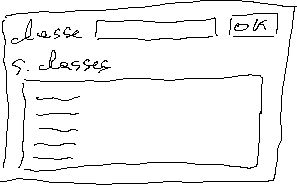

<!-- headingDivider: 1 -->
<!-- paginate: true -->
<!-- footer: "Pharo -- Le langage" -->

# Building UIs with Spec

- Model View Presenter 
- Object Oriented


# The MVP pattern


- Model
- View
- Presenter 


# Presenter
  - Spec generates automatically the view for a presenter
  - A presenter is composed of simpler presenters
  

# Defining a presenter


- Subclass `SpPresenter`
- Often 1 instance variable per internal wideget
- Overrides methods:
    - `#defaultLayout`
    - `#initializePresenters`
    - `#connectPresenter`


# #initializePresenters


```St
initializePresenters
  title := self newDropList .
  name := self newDropList .
  date := self newTextInput .
  details := self newText.
  table := self newTable.
  ok := self newButton
    label:#ok;
	yourself.
  cancel := self newButton
    label:#cancel;
	yourself.
  ```

# #defaultLayout


```St
defaultLayout
  ^ SpBoxLayout newLeftToRight
      add: (SpBoxLayout newTopToBottom
        add: #title
          height: self toolbarHeight;
        add: #date
          height: self toolbarHeight;
        add: #details);
      add: (SpBoxLayout newTopToBottom
        add: #name
          height: self toolbarHeight;
        add: #table;
        add: (SpBoxLayout newLeftToRight
          add: #ok;
          add: #cancel));
      yourself
  ```

# #connectPresenters


```St
connectPresenters 
  ok action: [
    self inform:'Ok'
  ].
  cancel action: [
    self inform:'Cancel'
  ].
  ```


# Binding the model


```St
model: aModel
  model := aModel.
  self modelChanged.
```
```St
modelChanged
  self fillWidgetWithModel
```
```St
fillWidgetWithModel
  title selectedItem: model title.
  name selectedItem: model name. 
  date text: model birthDate. 
  details text: model details. 
  ```

# Exercice

- Créer l'interface suivante

- Entrer un nom de classe dans le champ texte et cliquer sur "OK" pour afficher la liste de ses sous-classes
- version avancée: les sous-classes sont dans une liste hiérarchique montrant l'héritage entre elles