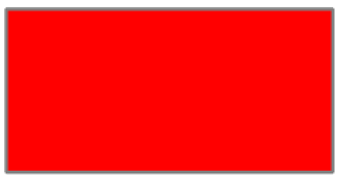

<!-- headingDivider: 1 -->
<!-- paginate: true -->
<!-- footer: "Roassal 3" -->

# Roassal

- Dans l'environnement Pharo
- Visualisation de données
- Un ensemble d'outils


#  Exemples

```smalltalk
"Animations"
RSAnimationExamples new example24RoassalPerlinNoise open extent: 800@500.
RSAnimationExamples new example09PerlinParticles open extent: 800@500.
"Charts"
RSChartExample new example24SpineLine open.
RSKiviatExample new example06Chemistry open.
"Images"
RSSVGAnimationExamples new example02Miku open.
"System complexity"
MySystemComplexity new example open extent: 900@600
```

# Roassal - Composants principaux

- **Canvas**
- **Shapes**
- **Layouts**
- **Events**
- **Interactions**

# Le canvas

- Contient et affiche les formes
- L'origine (0@0) se trouve au centre
```smalltalk
canvas := RSCanvas new.
canvas open
```


# Les formes
- Sous classes de `RSShape`
  - Rectangle : `RSBox`
  - Cercle : `RSCircle`
  - Ligne : `RSLine`
  - Texte : `RSLabel`
  - etc.

# Les formes
- Rectangle
```smalltalk 
rect := RSBox new.

```


- Cercle
```smalltalk 
circle := RSCircle new.

```


# Modifier les formes

Propriétés : `#height:`, `#width:`, `#color:`, `#border:`, `#borderColor:` 
```smalltalk 
rect height: 50;
     width: 100;
     color: Color red;
     border: RSBorder new.
```



# Les formes
- Associer une donnée utilisateur (modèle) aux formes
  - Une forme peut représenter un object Pharo
  - Actions sur la forme en fonction de l'objet représenté
```smalltalk
shape model: 1
```

# Les formes dans le canvas
```smalltalk 
canvas add: rect.
canvas add: circle.
"canvas addAll: {rect . circle}"
canvas open
```


# Application
Pour chaque classe de la hiérarchie de la classe `BLLazyServerPojo`, **collecter** un rectangle qui la décrit .
Le résultat doit être un ensemble de formes.
Ajouter ces formes dans un canvas et ouvrir le canvas.

# Les layouts
Permettent de gérer la disposition des objets sur le canvas.
Les sous classes de `RSLayout` : 
  - Disposition horizontale `RSHorizontalLineLayout`
  - Disposition verticale `RSVerticalLineLayout`
  - Disposition arborescente `RSTreeLayout`
  - etc.
```smalltalk
RSAnimationExamples new example33AnimatedLayout open
```

# Les layouts
- Disposition horizontale `RSHorizontalLineLayout`
```smalltalk
RSHorizontalLineLayout on: {circle, rect}.
canvas add: circle;
  add: rect.
canvas open
```


# Les liens
- Lier des formes
```smalltalk
line := RSLine new.
line from: rect;
  to: circle.
canvas add: line.
```


# Les liens
- Avec un point d'attache différent
```smalltalk
line := RSLine new.
line withBorderAttachPoint;
  from: rect;
  to: circle.
canvas add: line.
```


# Les liens
- Avec un builder
```smalltalk
RSLineBuilder line
  canvas: c;
  connectFrom: [ :model | ].
```


# Application
Créer des liens entre les classes et leur super classe.
Disposer les classe de façon à obtenir une arborescence.


# Les évènements

- Sous classes de `RSEvent`.
  - `RSMouseClick`, `RSMouseEnter`, `RSKeyDown`, etc.
```smalltalk
shape on: RSEvent do: [ :evt | "Action à réaliser" ]
```
# Application

Ajouter un évènement sur chaque forme, permettant d'inspecter son modèle au clic de la souris.

# Les interactions
Les sous classes de `RSInteraction` :
- Draggable `RSDraggable`
- Popup `RSPopup`
- Highlight `RSHighlightable`
- Menu `RSMenuActivable`
- etc.

```smalltalk
shape @ RSPopup "Affiche le nom du modèle au passage de la souris"
```

# Application
Ajouter une interaction qui permet d'afficher des informations d'une classe au survole de la souris.
Les informations :
- Nom
- Nombre de méthodes
- Nombre d'attributs
- Nombre de lignes de code

Ajouter une interaction qui colore les classes au passage de la souris.


# Quelques outils Roassal

- Normalizer
```smalltalk
RSNormalizer height
  shapes: c shapes;
  normalize: #size.
```
- Exporters (pdf, svg, png, ...)
```smalltalk
RSPNGExporter new
		canvas: self;
    filname: 'myCanvas';
    export
```

# Application
Modifier votre visualisation afin d'adapter la taille des classes en fonction de leurs propriétés :

- La hauteur : nombre de méthodes de la classe
- La largeur : nombre d'attributs de la classe
- La couleur : nombre de ligne de code

Ajouter une bordure verte sur les classes abstraites.

---

---

# Ressources

- Github (MIT)
  - https://github.com/ObjectProfile/Roassal3
- Documentation
  - https://github.com/ObjectProfile/Roassal3Documentation
- Exporters
  - https://github.com/ObjectProfile/Roassal3Exporters
- Agile Visualization
  - http://agilevisualization.com/